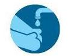

# ଘର ବିଚ୍ଛିନ୍ନତା\(Home Isolation\)

## ସଙ୍ଗରୋଧ କଠୋରୀ

ଆପଣ ନିମ୍ନଲିଖିତ ପ୍ରତିକାର ଗୁଡିକୁ ପାଳନ କରିବା ଅନିର୍ବାର୍ଯ୍ୟ ଯେବେ ଯାଏଁ କୌଣସି ସ୍ୱାସ୍ଥ୳ ବିଷେଶଜ୍ଞ ତଥା ସ୍ୱାସ୍ଥ୍ୟ କର୍ମଚାରୀ ଆପଣଙ୍କୁ ସାଧାରାଣ ଭାବେ ଜୀବନ ଯାପନ କରିବାକୁ ପରାମର୍ଶ ନ ଦେଇଛନ୍ତି \|

* ସନ୍ଦିଗ୍ଧ ରୋଗୀ ଜଣକ ଉତ୍ତମ ବାୟୁ ଚଳାଚଳ  ହେଉଥିବା କଠୋରୀରେ ରୁହନ୍ତୁ  
* ଘରର ଝରକା ଗୁଡି଼କ ଖୋଲା ରଖିବା ଆବଶ୍ୟକ  
* ସନ୍ଦିଗ୍ଧ ରହୁଥିବା କଠୋରୀ ସଂଲଗ୍ନ ଶୌଚାଳୟ ରହିବ ଆବଶ୍ୟକ
*  ଆସବାବପତ୍ର ,ବାସନକୁସନ, ତଥା ନିତ୍ୟ ବ୍ୟବହାର୍ଯ୍ୟ ଜିନିଷ ଅଲଗା ରଖିବା ଦରକାର 
* ନିୟମିତ ଭାବେ ନିଜର ହାତକୁ ସାବୁନ ଓ ପାଣିରେ ଧୋଇବା   ଅଭ୍ୟାସ କରନ୍ତୁ  
* ବିଶେଷ ଭାବରେ  ଶୌଚ ପରେ ଅଥବା ଶରୀରର ତରଳ ପଦାର୍ଥ ସଂପର୍ଶ ରେ ଆସିବା ପରେ
* ଶାରୀରିକ ସ୍ୱଛତା ରକ୍ଷା କରନ୍ତୁ 
* ଶୁଦ୍ଧ ଶ୍ଵାସକ୍ରିୟା ପାଳନ  କରନ୍ତୁ   
* କାଶ ବା ଛିଙ୍କ ହେବା ସମୟରେ ମୁହଁ ଓ ନାକକୁ ମାସ୍କ ବା ଟିସୁରେ ଘୋଡାନ୍ତୁ ରଖନ୍ତୁ    
* ଯଦି ମାସ୍କ ବା ଟିସୁ  ନଥାଏ ତେବେ କାଶ ବା ଛିଙ୍କ ହେବା ସମୟରେ ହାତ କହୁଣୀକୁ  ବ୍ୟବହାର କରନ୍ତୁ 

ତିନି ପ୍ରକାର ବର୍ଜ୍ୟବସ୍ତୁ ନିଷ୍କାସନ ର ଉପାୟ 1_ଶଣବସ୍ତ୍ର ତଥା ବ୍ୟବହୃତ ବସ୍ତ୍ର ଗୁଡିକୁ ବ୍ଲିଚିଂ ରେ ସଫା କରି ସୂର୍ଯ୍ୟ କିରଣ ରେ ଶୁଖାଇବା ଦରକାର 2_ବ୍ୟବହୃତ ମାସ୍କ,ଟିସୁ ଓ ପ୍ୟାଡ଼ କୁ ଜଳାଇଦେବା ଦରକାର 3\*ବ୍ୟବହୃତ ଔଷଧ ଖୋଲା ତଥା ଜୈବିକ ଔଷଧ କୁ ମାଟିରେ ପୋତିଦେବା ଦରକାର

_କଠୋରୀ କୁ ବ୍ଲିଚିଙ୍ଗ ଯୁକ୍ତ ରାସାୟନିକ ତରଳ ପଦାର୍ଥରେ ସଫା କରିବା ଆବଶ୍ୟକ ,_ ସନ୍ଦିଗ୍ଧ ଙ୍କ କଠୋରୀକୁ ଯାଉଥିବା ବ୍ୟକ୍ତି ହାତ କୁ ସାବୁନ ରେ ବାରମ୍ବାର ଧୋଇବା ଆବଶ୍ୟକ \| _କୌଣସି ବାହାର ବ୍ୟକ୍ତି ସେହି କଠୋରୀ କୁ ଯିବା ନିଷେଧ କରିବା ଉଚିତ_ ସାମାଜିକ ଯାତାୟାତ କରିବା ଉଚିତ ନୁହେଁ  
\*ସାମାଜିକ ଦୂରତ୍ୱ ରକ୍ଷା କରନ୍ତୁ ,ଯାତାୟାତରୁ ବିରତ ରୁହନ୍ତୁ

### କାହା ପାଇଁ ଉଦ୍ଧିଷ୍ଟ -----

ବିଭିନ୍ନ ସ୍ୱାସ୍ଥ୍ୟ କର୍ମଚାରୀ ତଥା ସରକାରୀ ସେବା ପ୍ରଦାନ କରୁଥିବା କର୍ମଚାରୀ ମାନେ COVID-19 ସନ୍ଦିଗ୍ଧ ବ୍ୟକ୍ତି ଓ ସଙ୍ଗରୋଧ ରେ ରହୁଥିବା ବ୍ୟକ୍ତି ମାନଙ୍କ ଦେଖାଶୁଣା କରୁଛନ୍ତି \|

> COVID-19 ବ୍ୟାପିବାର ପ୍ରତିଷେଧକ ବିବରଣୀ ତଥା ନିର୍ଦେଶାବଳୀ [COVID-19 ସନ୍ଦିଗ୍ଧ ବ୍ୟକ୍ତିଙ୍କ ପାଇଁ ପ୍ରଯୁଜ୍ୟ ତଥା ସଙ୍ଗରୋଧ. ବ୍ୟକ୍ତିଙ୍କ ପାଇଁ ପ୍ରଯୁଜ୍ୟ](https://www.cdc.gov/coronavirus/2019-ncov/hcp/disposition-in-home-patients.html)

