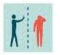

# ମୁଁ ସଂକ୍ରମିତ\(i am infected\)

 ଯଦି ଆପଣ COVID-19 ସହିତ ଅସୁସ୍ଥ ଅଛନ୍ତି କିମ୍ବା ସନ୍ଦେହ କରୁଛନ୍ତି ଯେ ଆପଣ COVID-19 ସୃଷ୍ଟି କରୁଥିବା ଜୀବାଣୁ ଦ୍ୱାରା ସଂକ୍ରମିତ ଅଛନ୍ତି,ଏହି ରୋଗ ଆପଣଙ୍କ ଘର ଏବଂ ସମ୍ପ୍ରଦାୟର ଲୋକମାନଙ୍କ ନିକଟରେ ବ୍ୟାପିବାରେ ସାହାଯ୍ୟ କରିବାକୁ ନିମ୍ନରେ ଥିବା ପଦକ୍ଷେପଗୁଡ଼ିକୁ ଅନୁସରଣ କରନ୍ତୁ \|

## ଚିକିତ୍ସା ପାଇବା ବ୍ୟତୀତ ଘରେ ରୁହନ୍ତୁ 

* **ଘରେ ରୁହନ୍ତୁ:** ଯେଉଁମାନେ COVID-19 ସହିତ ସାମାନ୍ୟ ଅସୁସ୍ଥ, ସେମାନେ ଅସୁସ୍ଥତା ସମୟରେ ଘରେ ଅଲଗା ହୋଇପାରିବେ \| ଡାକ୍ତରୀ ଚିକିତ୍ସା ବ୍ୟତୀତ ତୁମ ଘର ବାହାରେ କାର୍ଯ୍ୟକଳାପକୁ ପ୍ରତିବନ୍ଧିତ କରିବା ଉଚିତ୍ \|
* **ସର୍ବସାଧାରଣ କ୍ଷେତ୍ରରୁ ଦୂରେଇ ରୁହନ୍ତୁ**: କାର୍ଯ୍ୟ, ବିଦ୍ୟାଳୟ କିମ୍ବା ସର୍ବସାଧାରଣ ସ୍ଥାନକୁ ଯାଆନ୍ତୁ ନାହିଁ \| 
* **ଜନସାଧାରଣ ପରିବହନରୁ ଦୂରେଇ ରୁହନ୍ତୁ**: ସାଧାରଣ ପରିବହନ, ରାଇଡ୍-ସେୟାରିଂ କିମ୍ବା ଟ୍ୟାକ୍ସି ବ୍ୟବହାରରୁ ଦୂରେଇ ରୁହନ୍ତୁ \| 

## ନିଜ ଘରେ ଥିବା ଅନ୍ୟ ଲୋକ ଏବଂ ପଶୁମାନଙ୍କଠାରୁ ନିଜକୁ ଅଲଗା କର

* **ଅନ୍ୟମାନଙ୍କଠାରୁ ଦୂରରେ ରୁହନ୍ତୁ:** ଯଥାସମ୍ଭବ, ଆପଣ ଏକ ନିର୍ଦ୍ଦିଷ୍ଟ କୋଠରୀରେ ରହିବା ଉଚିତ୍ ଏବଂ ଆପଣଙ୍କ ଘରର ଅନ୍ୟ ଲୋକଙ୍କଠାରୁ ଦୂରରେ ରହିବା ଉଚିତ୍ \| ଆହୁରି ମଧ୍ୟ, ଯଦି ଉପଲବ୍ଧ ତେବେ ଆପଣ ଏକ ଅଲଗା ବାଥରୁମ୍ ବ୍ୟବହାର କରିବା ଉଚିତ୍ \| 

* **ଗୃହପାଳିତ ପଶୁ ଏବଂ ପଶୁମାନଙ୍କ ସହିତ ସମ୍ପର୍କ ସୀମିତ କରନ୍ତୁ:** ଆପଣ COVID-19 ରେ ଅସୁସ୍ଥ ଥିବାବେଳେ ଗୃହପାଳିତ ପଶୁ ଏବଂ ଅନ୍ୟ ପ୍ରାଣୀମାନଙ୍କ ସହିତ ସମ୍ପର୍କକୁ ସୀମିତ ରଖିବା ଉଚିତ୍, ଯେପରି ଆପଣ ଅନ୍ୟ ଲୋକଙ୍କ ପରି \| ଯଦିଓ ଗୃହପାଳିତ ପଶୁ କିମ୍ବା ଅନ୍ୟ ପ୍ରାଣୀମାନେ COVID-19 ସହିତ ଅସୁସ୍ଥ ହୋଇଥିବାର ଖବର ଆସିନାହିଁ, ତଥାପି COVID-19 ରୋଗୀମାନେ ପଶୁମାନଙ୍କ ସହିତ ସମ୍ପର୍କ ସୀମିତ ରଖିବା ପର୍ଯ୍ୟନ୍ତ ପରାମର୍ଶ ଦିଆଯାଇଛି ଯେପର୍ଯ୍ୟନ୍ତ ଜୀବାଣୁ ବିଷୟରେ ଅଧିକ ସୂଚନା ଜଣାପଡେ ନାହିଁ \| ଯେତେବେଳେ ସମ୍ଭବ, ତୁମେ ଅସୁସ୍ଥ ଥିବାବେଳେ ତୁମର ଘରର ଅନ୍ୟ ସଦସ୍ୟ ତୁମର ପଶୁମାନଙ୍କ ଯତ୍ନ ନିଅ \| 

* ଯଦି ଆପଣ COVID-19 ସହିତ ଅସୁସ୍ଥ ଅଛନ୍ତି, ତେବେ ଗୃହପାଳିତ ପଶୁଙ୍କ ସହିତ ଯୋଗାଯୋଗରୁ ଦୂରେଇ ରୁହନ୍ତୁ, ପୋଷା, ଚୋରି, ଚୁମ୍ବନ କିମ୍ବା ଚାଟିବା ଏବଂ ଖାଦ୍ୟ ବାଣ୍ଟିବା \| ଯଦି ତୁମେ ଅସୁସ୍ଥ ଥିବାବେଳେ ତୁମର ଗୃହପାଳିତ ପଶୁଙ୍କ ଯତ୍ନ ନେବାକୁ କିମ୍ବା ପଶୁମାନଙ୍କ ପାଖରେ ରହିବାକୁ ପଡିବ, ଗୃହପାଳିତ ପଶୁମାନଙ୍କ ସହିତ ଯୋଗାଯୋଗ କରିବା ପୂର୍ବରୁ ଏବଂ ପରେ ହାତ ଧୋଇ ଫେସମାସ୍କ ପିନ୍ଧ \| 

## ତୁମ ଡାକ୍ତରଙ୍କୁ ଦେଖା କରିବା ପୂର୍ବରୁ ଆଗକୁ ଡାକ  

ଯଦି ଆପଣଙ୍କର ଡାକ୍ତରୀ ନିଯୁକ୍ତି ଅଛି, ସ୍ୱାସ୍ଥ୍ୟ ସେବା ପ୍ରଦାନକାରୀଙ୍କୁ ଡାକନ୍ତୁ ଏବଂ ସେମାନଙ୍କୁ କୁହନ୍ତୁ ଯେ ଆପଣଙ୍କର COVID-19 ଅଛି କିମ୍ବା ଅଛି \| ଏହା ସ୍ୱାସ୍ଥ୍ୟ ସେବା ପ୍ରଦାନକାରୀଙ୍କ କାର୍ଯ୍ୟାଳୟକୁ ଅନ୍ୟ ଲୋକଙ୍କୁ ସଂକ୍ରମିତ କିମ୍ବା ସଂକ୍ରମିତ ନହେବା ପାଇଁ ପଦକ୍ଷେପ ନେବାରେ ସାହାଯ୍ୟ କରିବ \| 

## ଯଦି ଆପଣ ଅସୁସ୍ଥ ଅଛନ୍ତି ତେବେ ଫେସମାସ୍କ ପିନ୍ଧନ୍ତୁ 

* **ଯଦି ଆପଣ ଅସୁସ୍ଥ ଅଛନ୍ତି**: ଆପଣ ଯେତେବେଳେ ଅନ୍ୟ ଲୋକଙ୍କ ପାଖରେ ଥାଆନ୍ତି \(ଯଥା, ଗୋଟିଏ କୋଠରୀ କିମ୍ବା ଯାନ ବାଣ୍ଟିବା\) କିମ୍ବା ଗୃହପାଳିତ ପଶୁ ଏବଂ ଆପଣ ସ୍ୱାସ୍ଥ୍ୟ ସେବା ପ୍ରଦାନକାରୀଙ୍କ କାର୍ଯ୍ୟାଳୟରେ ପ୍ରବେଶ କରିବା ପୂର୍ବରୁ ଆପଣ ଏକ ଫେସମାସ୍କ ପିନ୍ଧିବା ଉଚିତ୍ \| 
* **ଯଦି ଆପଣ ଅନ୍ୟମାନଙ୍କ ଯତ୍ନ ନେଉଛନ୍ତି:** ଯଦି ଅସୁସ୍ଥ ବ୍ୟକ୍ତି ଫେସମାସ୍କ ପିନ୍ଧିବାକୁ ସକ୍ଷମ ନୁହଁନ୍ତି \(ଉଦାହରଣ ସ୍ୱରୂପ, ଏହା ଶ୍ୱାସ ନେବାରେ ଅସୁବିଧା ସୃଷ୍ଟି କରେ\), ତେବେ ଅସୁସ୍ଥ ବ୍ୟକ୍ତିଙ୍କ ସହିତ ରହୁଥିବା ଲୋକମାନେ ସେମାନଙ୍କ ସହିତ ଗୋଟିଏ କୋଠରୀରେ ରହିବା ଉଚିତ୍ ନୁହେଁ \| , କିମ୍ବା ସେମାନେ ଅସୁସ୍ଥ ବ୍ୟକ୍ତିଙ୍କ ସହିତ ଏକ କୋଠରୀରେ ପ୍ରବେଶ କଲେ ସେମାନେ ଫେସମାସ୍କ ପିନ୍ଧିବା ଉଚିତ୍ \| 

## ତୁମର କାଶ ଏବଂ ଛିଙ୍କିକୁ ଘୋଡାଇ ରଖ 

* **ଆଚ୍ଛାଦନ**: କାଶ କିମ୍ବା ଛିଙ୍କିବା ସମୟରେ ପାଟି ଏବଂ ନାକକୁ ଏକ ଟିସୁରେ ଘୋଡାନ୍ତୁ \|

* _ନିଷ୍କାସନ କରନ୍ତୁ:_ ବ୍ୟବହୃତ ଟିସୁକୁ ଏକ ଧାଡିରେ ଆବର୍ଜନା ପାତ୍ରରେ ପକାନ୍ତୁ \| 

* **ହାତ ଧୋଇ ଦିଅନ୍ତୁ:** ତୁରନ୍ତ ଅତି କମରେ 20 ସେକେଣ୍ଡ ପାଇଁ ସାବୁନ୍ ଏବଂ ପାଣିରେ ହାତ ଧୋଇ ଦିଅନ୍ତୁ କିମ୍ବା ଯଦି ସାବୁନ୍ ଏବଂ ପାଣି ଉପଲବ୍ଧ ନଥାଏ, ତେବେ ଏକ ମଦ୍ୟପାନ ଭିତ୍ତିକ ହ୍ୟାଣ୍ଡ ସାନିଟାଇଜର ସହିତ ହାତକୁ ସଫା କରନ୍ତୁ ଯେଉଁଥିରେ ଅତି କମରେ 60% ମଦ୍ୟପାନ ଅଛି \| 

## ବାରମ୍ବାର ହାତ ସଫା କର \| 

* **ହାତ ଧୋଇ ଦିଅନ୍ତୁ**: ଅତି କମରେ 20 ସେକେଣ୍ଡ ପାଇଁ ସାବୁନ୍ ଏବଂ ପାଣିରେ ହାତ ଧୋଇ ଦିଅନ୍ତୁ, ବିଶେଷ କରି ନାକ ଫୁଟାଇବା, କାଶିବା କିମ୍ବା ଛିଙ୍କିବା ପରେ; ବାଥରୁମକୁ ଯିବା; ଏବଂ ଖାଇବା ପୂର୍ବରୁ କିମ୍ବା ଖାଦ୍ୟ ପ୍ରସ୍ତୁତ କରିବା ପୂର୍ବରୁ \| 
* **ହ୍ୟାଣ୍ଡ ସାନିଟାଇଜର**: ଯଦି ସାବୁନ ଏବଂ ପାଣି ସହଜରେ ଉପଲବ୍ଧ ନଥାଏ, ତେବେ ଅତି କମରେ 60% ମଦ୍ୟପାନ ସହିତ ଏକ ଆଲକୋହଲ୍ ଆଧାରିତ ହ୍ୟାଣ୍ଡ ସାନିଟାଇଜର ବ୍ୟବହାର କରନ୍ତୁ, ଆପଣଙ୍କ ହାତର ସମସ୍ତ ପୃଷ୍ଠକୁ ଆଚ୍ଛାଦନ କରନ୍ତୁ ଏବଂ ଶୁଖିବା ପର୍ଯ୍ୟନ୍ତ ଏକତ୍ର ଘଷନ୍ତୁ \|
* **ସାବୁନ୍ ଏବଂ ପାଣି:** ଯଦି ହାତ ଦୃଶ୍ୟମାନ ଅପରିଷ୍କାର ହୁଏ ତେବେ ସାବୁନ୍ ଏବଂ ପାଣି ହେଉଛି ସର୍ବୋତ୍ତମ ବିକଳ୍ପ \| 
* **ଛୁଇଁବା ଠାରୁ ଦୂରେଇ ରୁହନ୍ତୁ:** ଆଖି, ନାକ ଏବଂ ପାଟିକୁ ଧୋଇ ନଥିବା ହାତରେ ଛୁଇଁବା ଠାରୁ ଦୂରେଇ ରୁହନ୍ତୁ \| 

## ବ୍ୟକ୍ତିଗତ ଘରୋଇ ଜିନିଷ ବାଣ୍ଟିବା ଠାରୁ ଦୂରେଇ ରୁହନ୍ତୁ 

* **ଅଂଶୀଦାର କରନ୍ତୁ ନାହିଁ:** ଆପଣ ନିଜ ଘରେ ଥିବା ଅନ୍ୟ ଲୋକ କିମ୍ବା ଗୃହପାଳିତ ପଶୁମାନଙ୍କ ସହିତ ଡିସ୍, ଗ୍ଲାସ୍, କପ୍ ପିଇବା, ବାସନ, ଟାୱେଲ୍ ଖାଇବା କିମ୍ବା ଶଯ୍ୟା ଖାଇବା ଉଚିତ୍ ନୁହେଁ \| 
* **ବ୍ୟବହାର ପରେ ଭଲ ଭାବରେ ଧୋଇ ଦିଅନ୍ତୁ:** ଏହି ଜିନିଷଗୁଡିକ ବ୍ୟବହାର କରିବା ପରେ, ସେମାନଙ୍କୁ ସାବୁନ୍ ଏବଂ ପାଣିରେ ଭଲ ଭାବରେ ଧୋଇବା ଉଚିତ୍ \| 

## ସମସ୍ତ “ହାଇ-ସ୍ପର୍ଶ” ପୃଷ୍ଠଗୁଡ଼ିକୁ ପ୍ରତିଦିନ ସଫା କରନ୍ତୁ 

* **ପରିଷ୍କାର ଏବଂ ନିଷ୍କାସନ କରନ୍ତୁ:** ଉଚ୍ଚ ସ୍ପର୍ଶ ପୃଷ୍ଠଗୁଡ଼ିକର ରୁଟିନ୍ ସଫା କରିବା ଅଭ୍ୟାସ କରନ୍ତୁ \|  ଉଚ୍ଚ ସ୍ପର୍ଶ ପୃଷ୍ଠଗୁଡ଼ିକରେ କାଉଣ୍ଟର, ଟାବଲେଟ୍, ଡୋରକୋନ୍ବ, ବାଥରୁମ୍ ଫିକ୍ଚର୍, ଟଏଲେଟ୍, ଫୋନ୍, କୀବୋର୍ଡ୍, ଟାବଲେଟ୍, ଏବଂ ବେଡ୍ ସାଇଡ୍ ଟେବୁଲ୍ ଅନ୍ତର୍ଭୁକ୍ତ \| 

* **ତରଳ ପଦାର୍ଥ ସହିତ ଡିଜେନ୍ସିଫିକ୍ କରନ୍ତୁ**: ଏଥିସହ ଯେକଣସି ପୃଷ୍ଠକୁ ସଫା କରନ୍ତୁ ଯେଉଁଥିରେ ରକ୍ତ, ଷ୍ଟୁଲ କିମ୍ବା ଶରୀରର ତରଳ ପଦାର୍ଥ ଥାଇପାରେ \| 
* **ଘରୋଇ କ୍ଲିନର୍ସ**: ଲେବଲ୍ ନିର୍ଦ୍ଦେଶ ଅନୁଯାୟୀ ଏକ ଘରୋଇ ସଫେଇ ସ୍ପ୍ରେ ବ୍ୟବହାର କରନ୍ତୁ କିମ୍ବା ପୋଛି ଦିଅନ୍ତୁ \| ସଫେଇ ଦ୍ରବ୍ୟର ନିରାପଦ ଏବଂ ପ୍ରଭାବଶାଳୀ ବ୍ୟବହାର ପାଇଁ ଲେବଲଗୁଡିକରେ ନିର୍ଦ୍ଦେଶ ରହିଛି ଯେଉଁଥିରେ ଆପଣ ଉତ୍ପାଦ ପ୍ରୟୋଗ କରିବା ସମୟରେ ସାବଧାନତା ଅବଲମ୍ବନ କରିବା ଉଚିତ, ଯେପରିକି ଗ୍ଲୋଭସ୍ ପିନ୍ଧିବା ଏବଂ ଉତ୍ପାଦର ବ୍ୟବହାର ସମୟରେ ଆପଣଙ୍କର ଭଲ ଭେଣ୍ଟିଲେସନ୍ ଅଛି ବୋଲି ନିଶ୍ଚିତ କରିବା \| 

## ଆପଣଙ୍କର ଲକ୍ଷଣଗୁଡିକ ଉପରେ ନଜର ରଖନ୍ତୁ 

* **ଡାକ୍ତରୀ ଧ୍ୟାନ ନିଅନ୍ତୁ**: ଯଦି ଆପଣଙ୍କର ରୋଗ ଖରାପ ହେଉଛି \(ଯଥା, ନିଶ୍ୱାସ ନେବାରେ ଅସୁବିଧା\) ତେବେ ତୁରନ୍ତ ଡାକ୍ତରୀ ଚିକିତ୍ସା ନିଅନ୍ତୁ \| 
* **ଆପଣଙ୍କର ଡାକ୍ତରଙ୍କୁ ଡାକନ୍ତୁ**: ଯତ୍ନ ନେବା ପୂର୍ବରୁ, ଆପଣଙ୍କର ସ୍ୱାସ୍ଥ୍ୟ ସେବା ପ୍ରଦାନକାରୀଙ୍କୁ ଡାକନ୍ତୁ ଏବଂ ସେମାନଙ୍କୁ କୁହନ୍ତୁ ଯେ ଆପଣଙ୍କର COVID-19 ପାଇଁ ମୂଲ୍ୟାଙ୍କନ କରାଯାଉଛି \| 
* **ଅସୁସ୍ଥ ହେଲେ ଫେସମାସ୍କ ପିନ୍ଧନ୍ତୁ**: ଆପଣ ସୁବିଧା ପ୍ରବେଶ କରିବା ପୂର୍ବରୁ ଫେସମାସ୍କ ପିନ୍ଧନ୍ତୁ \| ଏହି ପଦକ୍ଷେପଗୁଡିକ ସ୍ୱାସ୍ଥ୍ୟ ସେବା ପ୍ରଦାନକାରୀଙ୍କ କାର୍ଯ୍ୟାଳୟକୁ ଅନ୍ୟ ଲୋକଙ୍କୁ ଅଫିସ୍ କିମ୍ବା ଅପେକ୍ଷା କକ୍ଷରେ ସଂକ୍ରମିତ କିମ୍ବା ସଂସ୍ପର୍ଶରେ ଆସିବାକୁ ସାହାଯ୍ୟ କରିବ \| 
* **ସତର୍କ ସ୍ୱାସ୍ଥ୍ୟ ବିଭାଗ**: ଆପଣଙ୍କର ସ୍ୱାସ୍ଥ୍ୟ ସେବା ପ୍ରଦାନକାରୀଙ୍କୁ ସ୍ଥାନୀୟ କିମ୍ବା ରାଜ୍ୟ ସ୍ୱାସ୍ଥ୍ୟ ବିଭାଗକୁ ଡାକିବାକୁ କୁହନ୍ତୁ \| ସକ୍ରିୟ ମନିଟରିଂରେ ରଖାଯାଇଥିବା କିମ୍ବା ଆତ୍ମ-ମନିଟରିଂରେ ସୁବିଧାଜନକ ବ୍ୟକ୍ତିମାନେ ସେମାନଙ୍କର ସ୍ଥାନୀୟ ସ୍ୱାସ୍ଥ୍ୟ ବିଭାଗ କିମ୍ବା ବୃତ୍ତିଗତ ସ୍ୱାସ୍ଥ୍ୟ ବିଶେଷଜ୍ by ମାନଙ୍କ ଦ୍ୱାରା ଦିଆଯାଇଥିବା ନିର୍ଦ୍ଦେଶକୁ ଅନୁସରଣ କରିବା ଉଚିତ୍ \| 

## ଘର ବିଚ୍ଛିନ୍ନତା ବନ୍ଦ କରିବା 

* **ଛାଡିବାକୁ ନିର୍ଦ୍ଦେଶ ନହେବା ପର୍ଯ୍ୟନ୍ତ ଘରେ ରୁହନ୍ତୁ:** ନିଶ୍ଚିତ ହୋଇଥିବା COVID-19 ଥିବା ରୋଗୀମାନେ ଅନ୍ୟମାନଙ୍କୁ ଦ୍ ିତୀୟ ସଂକ୍ରମଣର ଆଶଙ୍କା କମ୍ ନହେବା ପର୍ଯ୍ୟନ୍ତ ଘର ବିଚ୍ଛିନ୍ନତା ସାବଧାନତା ଅବଲମ୍ବନ କରିବା ଉଚିତ୍ \| 
* **ଆପଣଙ୍କର ସ୍ୱାସ୍ଥ୍ୟ ସେବା ପ୍ରଦାନକାରୀଙ୍କ ସହ କଥାବାର୍ତ୍ତା କରନ୍ତୁ:** ସ୍ୱାସ୍ଥ୍ୟ ସେବା ପ୍ରଦାନକାରୀ ତଥା ରାଜ୍ୟ ତଥା ସ୍ଥାନୀୟ ସ୍ୱାସ୍ଥ୍ୟ ବିଭାଗର ପରାମର୍ଶ କ୍ରମେ ଗୃହ ବିଚ୍ଛିନ୍ନତା ସତର୍କତା ବନ୍ଦ କରିବାକୁ ନିଷ୍ପତ୍ତି କେସ୍-କେସ୍ ଆଧାରରେ ନିଆଯିବା ଉଚିତ୍।

 ଉତ୍ସ: [https://www.cdc.gov/coronavirus/2019-ncov/about/steps-when-sick.html](https://www.cdc.gov/coronavirus/2019-ncov/about/steps-when-sick.html)

