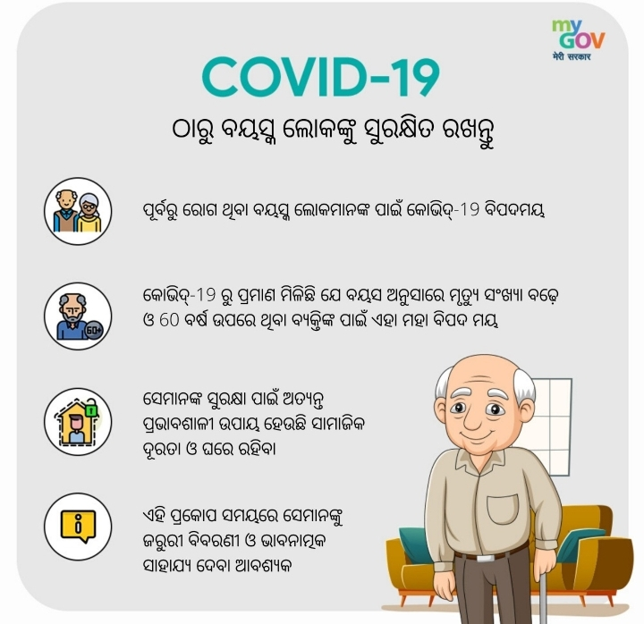

# ଭାରତରେ କରୋନାଭାଇରସର ବୟସ ଜ୍ଞାନୀ ରୋଗୀ\(Age-Wise Corona virus patients in India\)


83% ରୋଗୀ 50 ବର୍ଷରୁ କମ୍ ଥିବାରୁ ଯୁବକ ଭାରତୀୟମାନେ ଏହି ରୋଗରେ ଆକ୍ରାନ୍ତ ହେବାର ଅଧିକ ବିପଦ ରହିଛି।


| ବୟ |  |
| :--- | :--- |
| 60+ | 17% |
| 41-50 | 33% |
| 40 -21 | 42 % |
| &lt;20 | 9% |

ଉପଲବ୍ଧ ତଥ୍ୟ ସହିତ 10 ବର୍ଷରୁ କମ୍ ପିଲାମାନଙ୍କର ମୃତ୍ୟୁ ଖବର ନାହିଁ, ଏବଂ COVID-19 ରୁ ପିଲାମାନଙ୍କର ମୃତ୍ୟୁ ହାର ବହୁତ କମ୍ ଥିବା ପରି ମନେହୁଏ \| 

ପୂର୍ବରୁ ଚିକିତ୍ସିତ ଅବସ୍ଥାରେ ଥିବା ଲୋକମାନେ ଏକ ସମାନ କାହାଣୀ କୁହନ୍ତି \|  କିଛି ନିର୍ଦ୍ଦିଷ୍ଟ ଚିକିତ୍ସା ଅବସ୍ଥା ନଥିବା ଲୋକଙ୍କ ଅପେକ୍ଷା ଅନ୍ତର୍ନିହିତ ଚିକିତ୍ସା ଅବସ୍ଥା ଥିବା ଲୋକଙ୍କ ଅପେକ୍ଷା ଅଧିକ ବିପଦ ରହିଛି। \([ଉତ୍ସ](https://ourworldindata.org/coronavirus#case-fatality-rate-of-covid-19-by-preexisting-health-conditions)\)

| ଚିକିତ୍ସା ଅବସ୍ଥା  | ମୃତ୍ୟୁ ହାର% |
| :--- | :--- |
| ହୃଦ୍ ରୋଗ | 10.5% |
| ମଧୁମେହ | 7.3% |
| କ୍ରନିକ ଶ୍ୱାସ ରୋଗ | 6.3% |
| ଉଚ୍ଚ ରକ୍ତଚାପ  | 6.0%  |
| କର୍କଟ  | 5.6%  |
| ସ୍ୱାସ୍ଥ୍ୟ ଅବସ୍ଥା ନାହିଁ  |  0.9% |

ଏହା ସମସ୍ତ ସୂଚାଇଥାଏ ଯେ ଯଦି ଆପଣ ଉପରୋକ୍ତ କୌଣସି  ବର୍ଗର ଅଟନ୍ତି ତେବେ ଆପଣ COVID-19 ରୁ ଉଚ୍ଚ ବିପଦରେ ଅଛନ୍ତି \| ଆପଣଙ୍କୁ ବିଶେଷ ସତର୍କତା ଅବଲମ୍ବନ କରିବାକୁ ପଡିବ \|

## ଅଧିକ ବିପଦ ଥିବା ଲୋକଙ୍କ ପାଇଁ ଅତିରିକ୍ତ ସତର୍କତା \| 

ଉଚ୍ଚ ବିପଦ ବର୍ଗର ଲୋକମାନେ ଏହି ନିର୍ଦ୍ଦିଷ୍ଟ ସତର୍କତା ଗାଇଡ୍ ଅନୁସରଣ କରିବା ଉଚିତ୍ \| 

1. ଗ୍ରୋସରୀ ପରିଦର୍ଶନ ଏବଂ / କିମ୍ବା ଅର୍ଡରରୁ ଦୂରେଇ ରହିବା ପାଇଁ ଖାଦ୍ୟ ସାମଗ୍ରୀ ଏବଂ ଘର ଯୋଗାଣରେ ଷ୍ଟକ୍ ଅପ୍ କରନ୍ତୁ \| 
2. ଅନ୍ୟମାନଙ୍କଠାରୁ ନିରାପଦ ଦୂରତା \(ଆଦର୍ଶ ଭାବରେ 1 ମିଟର\) ବଜାୟ ରଖିବା ପାଇଁ ଅତିରିକ୍ତ ଯତ୍ନ ନିଅନ୍ତୁ \| 
3. ଯେତେବେଳେ ଏକ ସଂପୂର୍ଣ୍ଣ ଆବଶ୍ୟକୀୟ କାର୍ଯ୍ୟରେ ସର୍ବସାଧାରଣରେ ବାହାରକୁ ଯାଆନ୍ତୁ, ସମ୍ପର୍କକୁ ସୀମିତ କରନ୍ତୁ ଏବଂ ବାରମ୍ବାର ହାତ ଧୋଇ ଦିଅନ୍ତୁ \| 
4. ଯଥାସମ୍ଭବ ଭିଡ଼ରୁ ଦୂରେଇ ରୁହନ୍ତୁ \| 
5. ସମସ୍ତ ଅତ୍ୟାବଶ୍ୟକ ଆନ୍ତରାଜ୍ୟ ଭ୍ରମଣରୁ ଦୂରେଇ ରୁହନ୍ତୁ \|

## ଯୋଗାଣ 

1. ବିସର୍ଜନ ସମୟରେ ଅତିରିକ୍ତ ଆବଶ୍ୟକୀୟ ଔଷଧ ପାଇବା ବିଷୟରେ ପଚାରିବା ପାଇଁ ଆପଣଙ୍କର ସ୍ୱାସ୍ଥ୍ୟ ସେବା ପ୍ରଦାନକାରୀ \(ଡାକ୍ତର / କ୍ଲିନିକ୍ / ହସ୍ପିଟାଲ୍\) ସହିତ ଯୋଗାଯୋଗ କରନ୍ତୁ - ଆପଣଙ୍କୁ ଦୀର୍ଘ ସମୟ ପର୍ଯ୍ୟନ୍ତ ଘର ଭିତରେ ରହିବାକୁ ପଡିପାରେ \| 
2. କାଉଣ୍ଟର ଯୋଗାଣ \(ଟିସୁ ଇତ୍ୟାଦି\) ଏବଂ ଔଷଧ କ୍ରୟ କରାଯାଇପାରେ ଏବଂ ଯଦି ଆପଣ ଅସୁସ୍ଥ ହୋଇଯାଆନ୍ତି ଏବଂ ଘରର ଚିକିତ୍ସା ଆବଶ୍ୟକ କରନ୍ତି ତେବେ ପ୍ରସ୍ତୁତ ହୋଇପାରିବେ \| ଅଧିକାଂଶ ଲୋକ ଘରେ ସୁସ୍ଥ ହୋଇପାରିବେ \| 
3. ଅନାବଶ୍ୟକ ବାହ୍ୟ ସମ୍ପର୍କକୁ ଏଡାଇବା ପାଇଁ ହାତରେ ଖାଦ୍ୟ ସାମଗ୍ରୀ ଉପରେ ପର୍ଯ୍ୟାପ୍ତ ଘରୋଇ ସାମଗ୍ରୀ ରଖନ୍ତୁ \|

## ଯଦି COVID-19 ଆପଣଙ୍କ ଅଞ୍ଚଳରେ ବିସ୍ତାର କରୁଛି \|

 ଅନ୍ୟମାନଙ୍କଠାରୁ ସୁରକ୍ଷିତ ଦୂରତା ନିଶ୍ଚିତ କରିବାକୁ ଅତିରିକ୍ତ ପଦକ୍ଷେପ ନିଅନ୍ତୁ \| 

1. ଯଥାସମ୍ଭବ ଘରେ ରୁହନ୍ତୁ \| 
2. ଆପଣଙ୍କ ଘରକୁ ଯୋଗାଣ ବିତରଣର ଉପାୟ ବିଷୟରେ ବିଚାର କରନ୍ତୁ \| ପରିବାର, ସାମାଜିକ କିମ୍ବା ବାଣିଜ୍ୟିକ ନେଟୱାର୍କ \|



