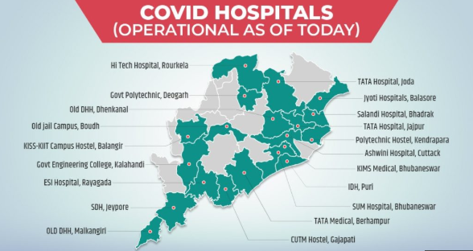
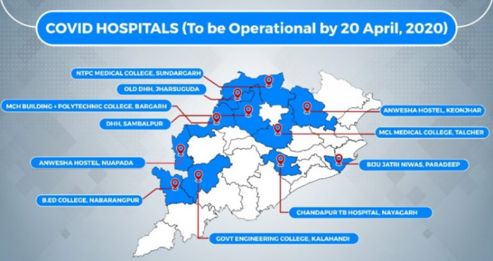

# ଓଡିଶା ରାଜ୍ୟ ରେ ସ୍ୱତନ୍ତ୍ର COVID ହସ୍ପିଟାଲ ତାଲିକା\(COVID-19 Hospitals in Odisha till now\)

## 24 ଟି COVID ଡାକ୍ତରଖାନା ଓଡିଶାରେ କାର୍ଯ୍ୟକ୍ଷମ, 11 ଏପ୍ରିଲ୍ 20 ସୁଦ୍ଧା \|

### ନିମ୍ନଲିଖିତଗୁଡ଼ିକ ହେଉଛି ଓଡିଶାର କାର୍ଯ୍ୟକ୍ଷମ COVID ଡାକ୍ତରଖାନା:

1. ଓଡ଼ିଶାର ଖଣି ନିଗମ \(ଓଏମସି\) ସହଯୋଗରେ କାଲିଙ୍ଗା ଇନଷ୍ଟିଚ୍ୟୁଟ୍ ଅଫ୍ ମେଡିକାଲ ସାଇନ୍ସ \(KIMS\) ଦ୍ୱାରା ପରିଚାଳିତ ବୋଲାଙ୍ଗୀରର କାଲିଙ୍ଗା ଇନଷ୍ଟିଚ୍ୟୁଟ୍ ଅଫ୍ ସୋସିଆଲ୍ ସାଇନ୍ସ \(କିସ୍\) କ୍ୟାମ୍ପସରେ COVID ହସ୍ପିଟାଲ୍ \| 
2. ଓଡ଼ିଶା ହାଇଡ୍ରୋ ପାୱାର କର୍ପୋରେସନ \(OHPC\) ଙ୍କ ସହଯୋଗରେ ବାଲାସୋରର ଜ୍ୟୋତି ହସ୍ପିଟାଲ ଦ୍ୱାରା ପରିଚାଳିତ COVID ହସ୍ପିଟାଲ \| 
3. ଭଦ୍ରାକ୍ର ସଲାଣ୍ଡି ହସ୍ପିଟାଲ୍ NTPC ଲିମିଟେଡ୍ ସହଯୋଗରେ COVID ହସ୍ପିଟାଲ୍ ଭାବରେ କାର୍ଯ୍ୟକ୍ଷମ \| 
4. ଓଡିଶା ଖଣି ନିଗମ \(ଓଏମସି\) ଙ୍କ ସହଯୋଗରେ କଟକର ଅଶ୍ୱିନୀ ହସ୍ପିଟାଲ COVID ହସ୍ପିଟାଲ ଭାବରେ କାର୍ଯ୍ୟକ୍ଷମ \| 
5. ଜାଜପୁର ଜିଲ୍ଲାର ଡୁବୁରୀରେ ଥିବା COVID ହସ୍ପିଟାଲ୍ ଟାଟା ଷ୍ଟିଲ୍ ଦ୍ୱାରା ପ୍ରତିଷ୍ଠିତ ଏବଂ ଉତ୍ସର୍ଗୀକୃତ \| 
6. କେଓନଜାର ଜିଲ୍ଲାର ଯୋଡା ଠାରେ ଥିବା COVID ହସ୍ପିଟାଲ ଟାଟା ଷ୍ଟିଲ ଦ୍ୱାରା ପ୍ରତିଷ୍ଠିତ ଏବଂ ଉତ୍ସର୍ଗୀକୃତ \| 
7. ଗଞ୍ଜାମ ଜିଲ୍ଲାର ବରହମପୁରର COVID ହସ୍ପିଟାଲ ଟାଟା ଷ୍ଟିଲ ଦ୍ୱାରା ପ୍ରତିଷ୍ଠିତ ଏବଂ ଉତ୍ସର୍ଗୀକୃତ \| 
8. ଓଡ଼ିଶା ଖଣି ନିଗମ \(ଓଏମସି\) ସହଯୋଗରେ କିମସ ଦ୍ୱାରା ପରିଚାଳିତ କାନ୍ଦାଲ ଜିଲ୍ଲାର ଫୁଲବାଣୀରେ ଥିବା ଏକ ଜିଏନଏମ ସେଣ୍ଟରରେ COVID ହସ୍ପିଟାଲ ପ୍ରତିଷ୍ଠା କରାଯାଇଥିଲା \|
9.  ଓଡ଼ିଶା ଖଣି ନିଗମ \(ଓଏମସି\) ଙ୍କ ସହଯୋଗରେ ଖୁରଡା ଜିଲ୍ଲାର ଭୁବନେଶ୍ୱରର KIMS ରେ COVID ହସ୍ପିଟାଲ \| 
10. ମହାନାଡି କୋଇଲଫିଲ୍ଡସ୍ ଲିମିଟେଡ୍ \(MCL\) ଙ୍କ ସହଯୋଗରେ ଖୁରଡା ଜିଲ୍ଲାର ଭୁବନେଶ୍ୱରର SUM ହସ୍ପିଟାଲରେ COVID ହସ୍ପିଟାଲ୍ \| 
11. ଓଡିଶା ଖଣି ନିଗମ \(ଓଏମସି\) ସହଯୋଗରେ ପୁରୀ ଜିଲ୍ଲାର ସଂକ୍ରାମକ ରୋଗ ହସପିଟାଲ \(IDH\) ରେ COVID ହସ୍ପିଟାଲ \| 
12. ଓଡ଼ିଶା ଖଣି ନିଗମ \(ଓଏମସି\) ଙ୍କ ସହଯୋଗରେ ପୁରୀ ଜିଲ୍ଲାର ଆୟୁର୍ବେଦିକ କଲେଜରେ COVID ହସ୍ପିଟାଲ \| 
13. ଓଡିଶା ଖଣି ନିଗମ \(ଓଏମସି\) ଙ୍କ ସହଯୋଗରେ ପୁରୀ ଜିଲ୍ଲାର ଜଗନ୍ନାଥ ସରକାରୀ ମେଡିକାଲ କଲେଜ ଏବଂ ହସ୍ପିଟାଲ \(MCH\) ରେ COVID ହସ୍ପିଟାଲ \| 
14. ଜିଲ୍ଲା ଖଣିଜ ପାଣ୍ଠି \(ଡିଏମ୍ଏଫ୍\) ସହଯୋଗରେ ସୁନ୍ଦରଗଡ ଜିଲ୍ଲାର ରାଉରକେଲାସ୍ଥିତ ହାଇ-ଟେକ୍ ମେଡିକାଲ୍ କଲେଜ କ୍ୟାମ୍ପସରେ COVID ହସ୍ପିଟାଲ୍ \| 
15. ଓଡ଼ିଶା ସରକାରଙ୍କ ଦ୍ୱାରା ପରିଚାଳିତ ଦେଓଗଡ ଜିଲ୍ଲାର ସରକାରୀ ପଲିଟେକ୍ନିକରେ ଥିବା COVID ହସ୍ପିଟାଲ୍ \| 
16. ଗଜପତି ଜିଲ୍ଲାର ସେଞ୍ଚୁରିଅନ୍ ୟୁନିଭରସିଟିର ଏକ ହଷ୍ଟେଲରେ COVID ହସ୍ପିଟାଲ୍ ଓଡିଶା ହାଇଡ୍ରୋ ପାୱାର୍ କର୍ପୋରେସନ୍ \(OHPC\) ର ସହଯୋଗରେ ହାଇ-ଟେକ୍ ମେଡିକାଲ୍ କଲେଜ ଦ୍ୱାରା ପରିଚାଳିତ \| 
17. କୋରାପୁଟ ଜିଲ୍ଲାର ଜେଇପୋରର ପୁରୁଣା ସବ-ଡିଭିଜନାଲ ହସ୍ପିଟାଲରେ COVID ହସ୍ପିଟାଲ \| 
18. ମାଲକାନଗିରି ଜିଲ୍ଲାର ପୁରୁଣା ଜିଲ୍ଲା ମୁଖ୍ୟାଳୟ ଡାକ୍ତରଖାନା \(DHH\) ରେ COVID ହସ୍ପିଟାଲ୍ \| 
19. ରାୟାଗଡା ଜିଲ୍ଲାର ESI ହସ୍ପିଟାଲରେ COVID ହସ୍ପିଟାଲ୍ \| 
20. କେନ୍ଦ୍ରାପଡା ଜିଲ୍ଲାର ଏକ ସରକାରୀ ପଲିଟେକ୍ନିକ୍ ହଷ୍ଟେଲରେ COVID ହସ୍ପିଟାଲ୍ ଓଡିଶା ସରକାରଙ୍କ ସହଯୋଗରେ SUM ହସ୍ପିଟାଲ୍ ଦ୍ୱାରା ପରିଚାଳିତ \| 
21. ଓଡିଶା ଖଣି ନିଗମ \(ଓଏମସି\) ସହଯୋଗରେ  େଙ୍କାନାଳ ଜିଲ୍ଲାର ପୁରୁଣା ଜିଲ୍ଲା ମୁଖ୍ୟାଳୟ ଡାକ୍ତରଖାନା \(DHH\) ରେ COVID ହସ୍ପିଟାଲ୍ \| 
22. ଓଡ଼ିଶା ସରକାରଙ୍କ ଦ୍ୱାରା ପରିଚାଳିତ ବୁଦ୍ଧ ଜିଲ୍ଲାର ଏକ ପୁରୁଣା ଜେଲ କ୍ୟାମ୍ପସରେ COVID ହସ୍ପିଟାଲ \| 
23. ଓଡ଼ିଶା ସରକାରଙ୍କ ଦ୍ୱାରା ପରିଚାଳିତ ସୁବର୍ଣ୍ଣପୁର ଜିଲ୍ଲାର ସରକାରୀ ଆଇଟି ବିଲ୍ଡିଂରେ COVID ହସ୍ପିଟାଲ \| 
24. ଓଡ଼ିଶା ଖଣି ନିଗମ \(ଓଏମସି\) ଙ୍କ ସହଯୋଗରେ ମୟୂରଭଞ୍ଜ ଜିଲ୍ଲାର ବରିପଡାସ୍ଥିତ କିସ୍ କ୍ୟାମ୍ପସରେ COVID ହସ୍ପିଟାଲ୍ \|

## ରିପୋର୍ଟ ଅନୁଯାୟୀ, 20 ଏପ୍ରିଲ ସୁଦ୍ଧା ଅନ୍ୟ 11 ଟି COVID-19 ଡାକ୍ତରଖାନା ମଧ୍ୟ ମହାମାରୀର ମୁକାବିଲା ପାଇଁ କାର୍ଯ୍ୟକ୍ଷମ ହେବ।

1. COVID ଡାକ୍ତରଖାନାଗୁଡ଼ିକ ଆଙ୍ଗୁଲ ଜିଲ୍ଲାର ତାଲଚେରର ମହାନାଦୀ ଇନଷ୍ଟିଚ୍ୟୁଟ୍ ଅଫ୍ ମେଡିକାଲ ସାଇନ୍ସ ଆଣ୍ଡ ରିସର୍ଚ୍ଚ \(MIMSAR\),
2.  Jharsuguda ଜିଲ୍ଲାର ପୁରୁଣା DHH,
3. ବରଗଡ ଜିଲ୍ଲାର ଏମସିଏ ବିଡିଂ
4. ଜଗାଟସିଂହପୁର ଜିଲ୍ଲାର ପାରାଦୀପରେ ବିଜୁ ଜାଟ୍ରି ନିୱାସ୍
5. କେଓନଜହରର ରାଙ୍କି ସ୍ଥିତ ଅନୱେଶା ହଷ୍ଟେଲ
6. ଜିଲ୍ଲା, ନବରଙ୍ଗପୁର ଜିଲ୍ଲାର ହିରଲିରେ ବି.ଡି କଲେଜ
7. ନୟାଗଡ଼ ଜିଲ୍ଲାର ଚାନ୍ଦପୁରରେ ଟିବି ହସ୍ପିଟାଲ
8. ନୁଆପଡା ଜିଲ୍ଲାର ଅନୱେଶା ହଷ୍ଟେଲ
9. କାଲାହାଣ୍ଡି ଜିଲ୍ଲାର ଭବାନୀପାଟନାରେ ସରକାରୀ ଇଞ୍ଜିନିୟରିଂ କଲେଜ
10.  ସମ୍ବଲପୁର ଜିଲ୍ଲାର DHH 
11.  ସୁନ୍ଦରଗଡ ଜିଲ୍ଲାର ଏନଟିପିସି ମେଡିକାଲ କଲେଜ



