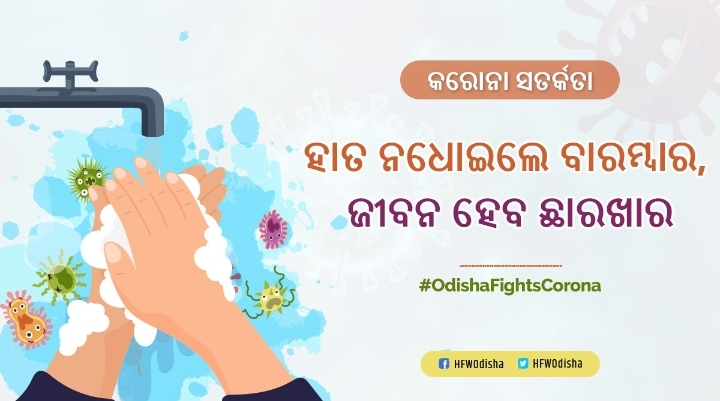
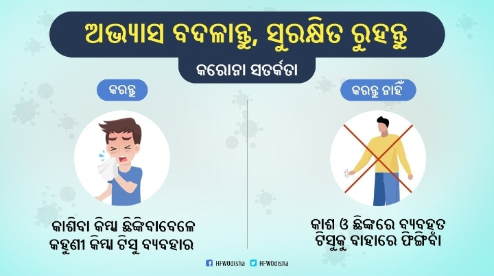

# ପ୍ରତିଷେଧାତ୍ମକ  ବ୍ୟବସ୍ଥା ଓ ନିବାରଣ ପ୍ରଣାଳୀ

## ପ୍ରତିଷେଧାତ୍ମକ  ବ୍ୟବସ୍ଥା ଓ ନିବାରଣ ପ୍ରଣାଳୀ

ଯଦିଓ COVID -19 ବ୍ୟାପିବା ଅତିସହଜ ହୋଇଥାଏ ସାମାଜିକ ସଂଗତି ଯୋଗୁଁ ତଥାପି ଯଦି ପ୍ରତିଷେଧକ ନିୟମାବଳୀ କୁ ସଭିଏଁ ମାନିବେ ତେବେ ନିହାତି ଭାବରେ ଏହାକୁ ବ୍ୟାପିବାରୁ ରୋକାଯାଇପାରିବ \| COVID -19 ରେ ଆକ୍ରାନ୍ତ ଥିବା ବ୍ୟକ୍ତି କାଶିବା ବା ଛିଙ୍କିବା ସମୟରେ ତାଙ୍କ ଠାରୁ ବାହାରୁ ଥିବା ତରଳ ପଦାର୍ଥ ସଂସ୍ପର୍ଶ ରେ ଆଶିଲେ ଏହି ରୋଗ ବ୍ୟାପି ଥାଏ \| ସେହିପରି ଏହି ତରଳ ପଦାର୍ଥ ସମ୍ପୃକ୍ତ ବ୍ୟକ୍ତି ଠାରୁ ୧ ମିଟର ଦୂରତା ଯାଏ ବ୍ୟାପୀପାରେ \| ଯେଉଁ ସ୍ଥାନ ରେ ଏହି ଭୁତାଣୁ ଥାଏ ସୁସ୍ଥ ବ୍ୟକ୍ତି ତା ସମ୍ପର୍କରେ ଆସିଲେ ଏହି ରୋଗ ରେ ପୀଡିତ ହୋଇଥାନ୍ତି \| ପୀଡିତ ଯଦି କାଶିବା ବା ଛିଙ୍କିବା ସମୟରେ ସୁସ୍ଥ ବ୍ୟକ୍ତି ଠାରୁ ୧ ମିଟର ଦୂରତା ରେ ରହିନଥାଏ ତେବେ ସୁସ୍ଥ ବ୍ୟକ୍ତି ସେ ରୋଗରେ ପୀଡିତ ହେବେ ନିଶ୍ଚୟ \| କୌଣସି ସ୍ଥାନରେ ଏହି ଭୁତାଣୁ ପଡିଲେ ଓ କେହିବି ଏହା ସଂସ୍ପର୍ଶ ରେ ଆସିଲେ ସେ ବ୍ୟକ୍ତି ଏହି ରୋଗରେ ପୀଡିତ ହୋଇପାରେ \|

## COVID -19 ବ୍ୟାପିବାର ପ୍ରତିଷେଧକତା

ଯଦିଓ ଏହି ଭୁତାଣୁ ବାୟୁ ଦ୍ୱାରା ସଂକ୍ରମିତ ହୋଇନଥାଏ ତଥାପିନିମ୍ନ ଲିଖିତ ନିୟମାବଳୀ କୁ ମାନି ନିଜକୁ ଏବଂ ଅନ୍ୟକୁ ସୁରକ୍ଷିତ ରଖନ୍ତୁ \|


ଯଦି ଆପଣଙ୍କ ବୟସ 60 ରୁ ଅଧିକ ତଥା ଆପଣଙ୍କୁ ହୃଦରୋଗ ,ମଧୁମେହ ,ରକ୍ତଚାପ ଆଦି ରୋଗ ଅଛି ବା , ଜ୍ୱର ,ଥଣ୍ଡା ,କାଶ , ଏବଂ ଅଧିକା ଦେହ ଖରାପ ଥିଲେ ଆଦି ରୋଗ ଅଛି ତେବେ ନିହାତି ଭାବରେ ଆପଣ ଅଧିକ ଯତ୍ନଶୀଳ ହୋଇ ନିଜକୁ ନିରାପଦ ରେ ରଖିବାକୁ ଚେଷ୍ଟା କରନ୍ତୁ କାହିଁକିନା ଆପଣଙ୍କୁ ଏହି ଭୁତାଣୁ ଅଧିକ କ୍ଷତି ପହଞ୍ଚାଇପାରେ ଏବଂ ଶୀଘ୍ର ଆକ୍ରମଣ କରିପାରେ \|ଜ୍ୱର ,ଥଣ୍ଡା ,କାଶ ବା ଅଧିକା ଦେହ ଖରାପ ଥିଲେ


### ହାତକୁ ସଫା ରଖିବା

ନିଜ ହାତକୁ ବାରମ୍ବାର ନିହାତି 20 ସେକେଣ୍ଡ ଯାଏଁ ସାବୁନ ଓ ପାଣିରେ ଧୋଇ ସଫା ରଖିବା ଦରକାର \|

### ପାଟି ,କାନ ,ନାକ ଓ ମୁହଁ କୁ ହାତ ମାରନ୍ତୁନି

ଏହି ଭୁତାଣୁ ଆଖି ,ପାଟି ,ନାକ ଓ ମୁହଁ ଦେଇ ଦେହ ଭିତରେ ପ୍ରବେଶ କରିଥାଏ ତେଣୁ ହାତକୁ ନ ଧୋଇ ମୁହଁ ,ଆଖି ,ପାଟି ,ନାକରେ ହାତ ମାରନ୍ତୁନି

### ସାମାଜିକ ଦୂରତ୍ୱ

ସାମାଜିକ ଯାତାୟାତ କରିବା ଉଚିତ ନୁହେଁ ,ସାମାଜିକ ଦୂରତ୍ୱ ରକ୍ଷା କରନ୍ତୁ ,ଯାତାୟାତରୁ ବିରତ ରୁହନ୍ତୁ \([https://www.who.int/emergencies/diseases/novel-coronavirus-2019/advice-for-public\)](https://www.who.int/emergencies/diseases/novel-coronavirus-2019/advice-for-public%29to)କାଶ ବା ଛିଙ୍କ ହେଉଥିବା  ବ୍ୟକ୍ତି ଠାରୁ  ୧ ମିଟର ସାମାଜିକ ଦୂରତା ରକ୍ଷା କରନ୍ତୁ  \|ଯଦି ସଂକ୍ରମିତ ବ୍ୟକ୍ତି ଙ୍କ  କାଶ ବା ଛିଙ୍କର ତରଳ ପଦାର୍ଥ ସମ୍ପୃକ୍ତ ବ୍ୟକ୍ତି ଠାରୁ ଆପଣଙ୍କ ଉପରେ ପଡେ ଓ ଆପଣ ଦୂରତାରକ୍ଷା କରିବେନି ତେବେ ନିଶ୍ଚିତଭାବେ ଆପଣ ମଧ୍ୟ ସେହି ରୋଗରେ ଅର୍ଥାତ  COVID -19 ପୀଡିତ ହେବାର ସମ୍ଭାବନା ବଢ଼ିଯିବ \|

### କାଶ ବା ଛିଙ୍କ ସମୟରେ

କାଶ ବା ଛିଙ୍କ ହେବା ସମୟରେ ମୁହଁ ଓ ନାକକୁ ମାସ୍କ ବା ଟିସୁରେ ଘୋଡାନ୍ତୁ ରଖନ୍ତୁ \|ଯଦି ମାସ୍କ ବା ଟିସୁ ନଥାଏ ତେବେ କାଶ ବା ଛିଙ୍କ ହେବା ସମୟରେ ହାତ କହୁଣୀକୁ ବ୍ୟବହାର କରନ୍ତୁ, ନିଜକୁ ଏବଂ ଅନ୍ୟକୁ ସୁରକ୍ଷିତ ରଖନ୍ତୁ\|

ସୂଚନା ନିଜକୁ ଓ ଅନ୍ୟଙ୍କୁ ଏହି ଭୁତାଣୁ ଠାରୁ ରକ୍ଷା କରନ୍ତୁ ଯଦି ଏହି ଭୁତାଣୁ ରେ ସଂକ୍ରମିତ ଥିବାର କାହାକୁ ସନ୍ଦେହ ଥାଏ ତେବେ ଆବଶ୍ୟକୀୟ ପଦକ୍ଷେପ ନିୟନ୍ତୁ\|

