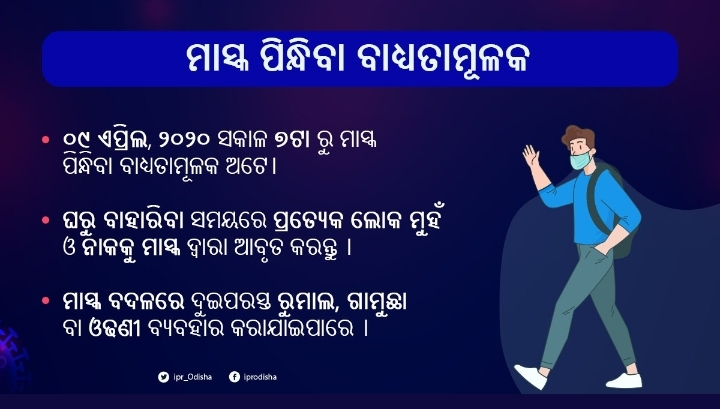

# କାର୍ଯ୍ୟକ୍ଷେତ୍ର ରେ କର୍ମଚାରୀଙ୍କ ପ୍ରତି ବିପଦ ହ୍ରାସ

## ପ୍ରତିରୋଧ

ବିପଦକୁ ହ୍ରାସ କରିବା ଏବଂ ଶ୍ରମିକମାନଙ୍କୁ ସବୁ ସମୟରେ କର୍ମକ୍ଷେତ୍ରର ବିପଦରୁ ରକ୍ଷା କରିବା ପାଇଁ ନିଯୁକ୍ତିଦାତା ସମସ୍ତ ପ୍ରୟୋଗନୀୟ ପଦକ୍ଷେପ ଗ୍ରହଣ କରିବା ଉଚିତ୍ \|

### କର୍ମକ୍ଷେତ୍ରରେ ସଂକ୍ରାମକ ରୋଗ ବିସ୍ତାର ହେବାର ଆଶଙ୍କା କମ୍ କରିବାକୁ ନିଯୁକ୍ତିଦାତାମାନେ ଅନେକ କାର୍ଯ୍ୟ କରିପାରିବେ:

* ସଂକ୍ରାମକ ରୋଗର ପ୍ରସାରକୁ ରୋକିବା ପାଇଁ ଶ୍ରମିକମାନଙ୍କୁ ବ୍ୟକ୍ତିଗତ କାର୍ଯ୍ୟ ଅନୁସରଣ କରିବାକୁ ଉତ୍ସାହିତ କରନ୍ତୁ \|
* କର୍ମଚାରୀମାନଙ୍କୁ ଉପଯୁକ୍ତ ସୁରକ୍ଷା ପ୍ରଦାନ କରନ୍ତୁ, ଯେଉଁମାନେ ସେମାନଙ୍କର କାର୍ଯ୍ୟର ପ୍ରକୃତି ଅନୁଯାୟୀ, ଅସୁସ୍ଥ ଲୋକମାନଙ୍କ ସହିତ ଯୋଗାଯୋଗ କରିବାକୁ ଆବଶ୍ୟକ କରିପାରନ୍ତି \|
* କର୍ମକ୍ଷେତ୍ରର ପରିବେଶକୁ ନିୟମିତ ସଫା କରିବା ଦ୍ୱାରା  ଦୂଷିତ ପୃଷ୍ଠଗୁଡ଼ିକ ସହିତ ଶ୍ରମିକଙ୍କ ସମ୍ପର୍କ ହ୍ରାସ ହୋଇ ସଂକ୍ରମଣର ବିସ୍ତାର କମିଯାଏ। ଯେଉଁଠାରେ ସମ୍ଭବ, ପୃଷ୍ଠଗୁଡ଼ିକୁ ସଫା କରିବା ପାଇଁ ଏକ ଥର ବ୍ୟବହାର କରାଯାଉଥିବା କପଡା ବ୍ୟବହାର କରନ୍ତୁ \| ପୁନବ୍ୟବହାର ଯୋଗ୍ୟ କପଡା ସଫା କରାଯିବା, ଡିଜେନ୍ସିଫିକେସନ୍ କରିବା ଏବଂ ବ୍ୟବହାର ପରେ ଶୁଖିବା ଉଚିତ୍ \|
* ଆବଦ୍ଧ ସ୍ଥାନଗୁଡିକ ସଂକ୍ରାମକ ରୋଗର ବିସ୍ତାରକୁ ବୃଦ୍ଧି  ହୋଇପାରେ  \| ନିଯୁକ୍ତିଦାତା ନିଶ୍ଚିତ କରିବା ଉଚିତ୍ ଯେ ଏୟାର କଣ୍ଡିସିନର ସିଷ୍ଟମଗୁଡିକ ଭଲ ଭାବରେ ପରିଚାଳିତ ହେଉଛି \| ଏହା ପରାମର୍ଶଦାୟକ ଯେ ଏୟାର କଣ୍ଡିସିନର ସିଷ୍ଟମଗୁଡ଼ିକ ବାୟୁକୁ ପୁନପ୍ରସାରଣ ନକରନ୍ତି ଏବଂ ଯଥାସମ୍ଭବ ବାହାରକୁ ଭେଣ୍ଟେଣ୍ଟ କରାଯାଏ \|
* କର୍ମଚାରୀଙ୍କ ପାଇଁ କାର୍ଯ୍ୟରୁ ଘର ବିକଳ୍ପକୁ ବିଚାର କରନ୍ତୁ \| ଅନୁସରଣ କରିବାକୁ  \(ଯେପରିକି HIPAA \) ପାଇଁ ବିଶେଷ ଅନୁପାଳନ ଅଛି, କର୍ମଚାରୀଙ୍କ ପାଇଁ ଏକ ବ୍ୟକ୍ତିଗତ VPN ସେଟ୍ ଅପ୍ କରିପାରନ୍ତି \|

## କଣ୍ଟିଜେନ୍ସି 

* କରୋନାଭାଇରସ୍ ଦ୍ୱାରା ବ୍ୟବସାୟ କିପରି ବ୍ୟାହତ ହୋଇପାରେ ଆକଳନ କରନ୍ତୁ;
* ଯୋଗାଣକାରୀ, ଗ୍ରାହକ ଏବଂ ଅନ୍ୟାନ୍ୟ ଦଳ ସହିତ ବିଦ୍ୟମାନ ଚୁକ୍ତିଗୁଡିକର ମୂଲ୍ୟାଙ୍କନ କର ଏବଂ ଫୋର୍ସ ମେଜର୍ ବ୍ୟବସ୍ଥାକୁ ବିଚାର କର;
* କାର୍ଯ୍ୟାଳୟର ଅସ୍ଥାୟୀ ବନ୍ଦକୁ ବିଚାର କରନ୍ତୁ, ଗୃହ ନୀତିରୁ କାର୍ଯ୍ୟ କରନ୍ତୁ ଏବଂ / କିମ୍ବା କର୍ମଚାରୀଙ୍କ ପାଇଁ ସମ୍ଭାବ୍ୟ ଛୁଟି; ଏବଂ
* ଇନଷ୍ଟିଚ୍ୟୁଟ୍ କଣ୍ଟିଜେନ୍ସି ଭ୍ରମଣ ଯୋଜନା \|

## ଦଳ ଆବଣ୍ଟନ 

ଆଇବିଏସ୍ ପରି କମ୍ପାନୀଗୁଡିକ ବିପର୍ଯ୍ୟୟ ସମୟରେ ଉତ୍ପାଦକତା ହ୍ରାସ ହେବାର ଆଶଙ୍କା ହ୍ରାସ କରିବାକୁ ନିମ୍ନରେ ସମାନ ବିକଳ୍ପ ଅନୁସରଣ କରିଛନ୍ତି:

* ଦଳକୁ ପୁନ ସଂଗଠିତ କରନ୍ତୁ ଯାହା କି  ଯେଉଁ କର୍ମଚାରୀଙ୍କର ସଂକ୍ରମଣ ହେବାର ଆଶଙ୍କା ଅଧିକ ଥାଏ ସେମାନଙ୍କ ସହିତ କମ୍ ବିପଦ ଥିବା ବ୍ୟକ୍ତିଙ୍କ ସହିତ ରଖାଯିବ ନାହିଁ।
* ଯଦି ଘରୁ କାମ ସମସ୍ତ କର୍ମଚାରୀଙ୍କୁ ବଣ୍ଟନ କରାଯାଇପାରିବ ନାହିଁ, ନିଶ୍ଚିତ କରନ୍ତୁ ଯେ ଏକ ଟିମରେ ଥିବା ପ୍ରାୟ ଅର୍ଦ୍ଧେକ କର୍ମଚାରୀ ଘର ସୁବିଧାରୁ କାମ କରୁଛନ୍ତି, ଯାହା ଦ୍ ାରା ବିପର୍ଯ୍ୟୟ ଘଟିଲେ ସମଗ୍ର ଦଳ ପ୍ରଭାବିତ ହେବେ ନାହିଁ।
* ବିସ୍ତାରକୁ ହ୍ରାସ କରିବା ପାଇଁ ଦଳର ଆକାରକୁ ସର୍ବନିମ୍ନ ରଖନ୍ତୁ \|

## ଉତ୍ସ: \[[https://www.health.govt.nz/ur](https://www.health.govt.nz/ur) //www.health.govt.nz/

